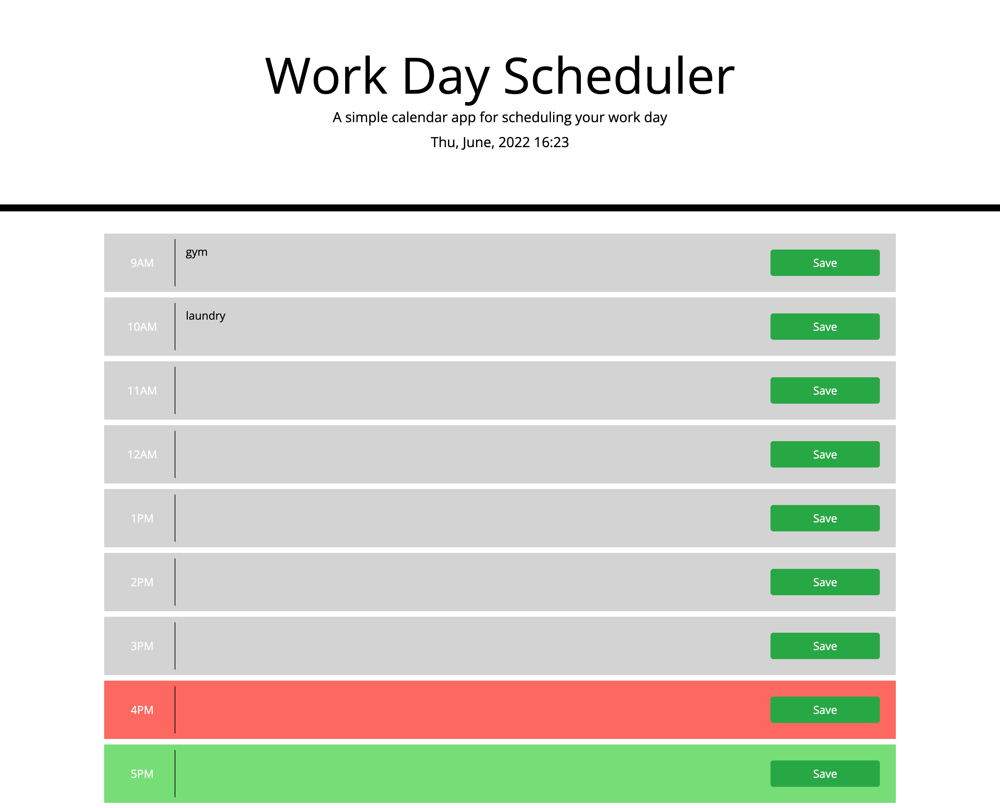

# work-day-planner

# About This Project

Create a simple calendar application that allows a user to save events for each hour of the day by modifying starter code. This app will run in the browser and feature dynamically updated HTML and CSS powered by jQuery.

By using [Moment.js](https://momentjs.com/) library to work with date and time. Be sure to read the documentation carefully and concentrate on using Moment.js in the browser.

# Deployed Link For This Project

- [GitHub](https://github.com/MohamedWarsame04/work-day-planner)
- [Live](https://mohamedwarsame04.github.io/work-day-planner//)

# The User Journey

- On page load the current day should be displayed on the page (Friday, 29th April, 2022)
- Use moment js format method to format your date
  https://momentjs.com/docs/#/displaying/format/

- On page load all working hours timeblocks should render

- As a user when I type in the event for a specific time and click on the save button for that time then the event is stored in LS

## Screenshots

Below are screenshots of desktop viewport.

# Technology Used

.JavaScript

.jQuery

.HTML

.CSS

.BootStrap

.VS Code

.GitHub
